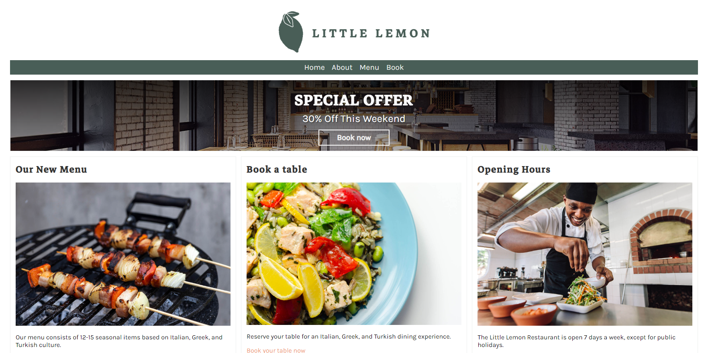

# Meta Django Web Framework Course - Final Assignment

<p>
    
</p>
<br>

For this assignment, it was given the task of creating an app for the fictitious Little Lemon restaurant using the Django Web Framework.

## How to run

To run the project, you need to have Python (version 3.8 was used in this project) and Django installed on your machine.

With that installed, you can run the following commands:

```bash
# Clone the repository
git clone https://github.com/amcerri/meta-django-web-framework-final-assignment.git

# From inside the "littlelemon" folder (project level folder), run the following command
python manage.py runserver
```

The project will be available at `http://localhost:8000/`.

To access the admin panel at `http://localhost:8000/admin/`, you can use the following credentials:

```bash
username: admin
password: admin@123!
```